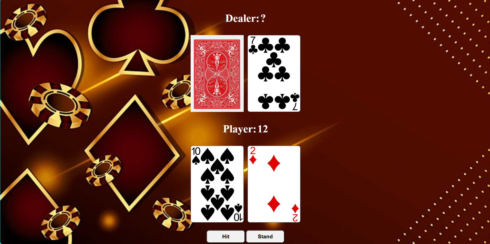
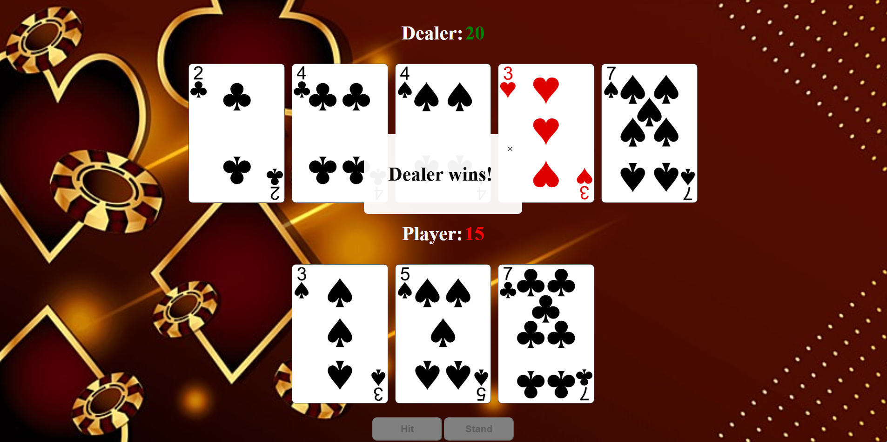

Blackjack App

This project is a simple Blackjack game implemented using HTML, CSS, and JavaScript.

The game allows you to play a classic Blackjack game against a dealer. The objective is to beat the dealer by having a hand value as close to 21 as possible without exceeding it.

Prerequisites

Visual Studio Code installed on your machine.
Live Server extension installed in VSCode.

How to Run the App

- Clone or Download the Project
- Clone this repository or download the source code and extract it to a folder on your machine.
- Open the Project in VSCode
- Select File > Open Folder... and navigate to the folder containing your project files.
- In the Explorer pane (usually on the left side of the window), locate the index.html file and click on it to open it in the editor.
- With the index.html file open, right-click on the editor and select Open with Live Server. Alternatively, you can click the Go Live button typically found at the bottom-right corner of the VSCode window.
- Your default web browser will open a new tab with the Blackjack game running. You can now interact with the game using mouse clicks.

Gameplay Instructions

- Hit: Draw another card.
- Stand: End your turn and let the dealer draw.
- The dealer must hit until their cards total 17 or more.
- If your hand exceeds 21, you lose. If the dealer exceeds 21, you win.
- If your hand is closer to 21 than the dealer's, you win. If it's lower, you lose. If they are equal, it's a tie.

